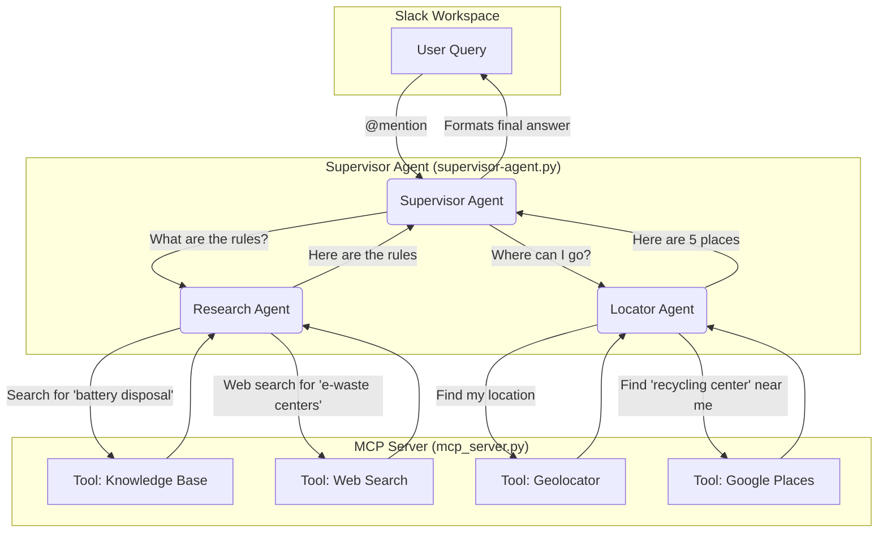

# kura-final-project
Project submission for final enterprise project as per Google's and Kura Labs' Agentic AI Learning Course

Challenge Statement and Architecture

**Challenge Statement: 
  -Our focus is on the helping businesses properly recycle their waste and follow the regulations as defined by their state or local city. Many cities within the United States have different recycling laws, which makes it difficult for sources to offer a comprehensive list and information to businesses. The United States produces a massive amount of waste each year. Waste produced also contributes to environmental degradation and threatens the safety and health of many people both in the U.S. and abroad. 


  Allocated budget: $5 for OpenAI key

 -------

 About our project:

A sophisticated multi-agent system, integrated with Slack, designed to answer questions about waste management and recycling regulations in NYC and other questions based on the users location. The system uses a supervisor-worker architecture powered by LangGraph and ReAct agents to delegate tasks and find accurate information.

## ✨ Overview

This project is a practical demonstration of a multi-agent AI. This system uses specialized agents, each with a distinct role, coordinated by a central supervisor. This allows for more complex, multi-step problem-solving.

When a user asks a question in Slack, a **Supervisor Agent** analyzes the query and delegates it to the appropriate specialist:

1.  A **Research Agent** first consults a specialized knowledge base (RAG) on NYC sanitation rules. If it can't find an answer, it performs a web search.
2.  A **Locator Agent** uses the user's IP to geolocate them and then leverages the Google Places API to find nearby disposal sites.

The backend for all the tools (like web search and geolocation) is handled by a separate **MCP Server**, which acts as a centralized "tool shed" for the agents.

-----

## 🏗️ System Architecture

The system is composed of two main services that must be run simultaneously: the **MCP Server** (the tool provider) and the **Supervisor Agent** (the application logic and Slack interface).



-----

## 🚀 Getting Started

Follow these steps to set up and run the project locally.

### 1\. Prerequisites

  * Python 3.10+
  * Git
  * A Slack workspace where you can install a custom bot.

### 2\. Clone the Repository

Open your terminal and clone the repository to your local machine.

```bash
git clone <your-repository-url>
cd <your-repository-name>
```

### 3\. Set Up a Virtual Environment

It's highly recommended to use a virtual environment to manage project dependencies. Since you prefer the terminal, you can run the following commands.

```bash
# Create a virtual environment
python -m venv .venv

# Activate the virtual environment
# On macOS/Linux:
source .venv/bin/activate
# On Windows:
# .\.venv\Scripts\activate
```

### 4\. Install Dependencies

Create a `requirements.txt` file in the root of your project with the following content:

**`requirements.txt`**

```
fastmcp
langchain
langchain-openai
langgraph-supervisor
langchain-mcp-adapters
slack_bolt
python-dotenv
langchain_community
langchain_chroma
langchain-tavily
httpx
uvicorn
```

Then, install all the required packages using pip:

```bash
pip install -r requirements.txt
```

### 5\. Configure Environment Variables

You'll need several API keys for the system to function. Create a file named `.env` in the root of your project. **Do not commit this file to GitHub.**

First, create a `.env.example` file to show what variables are needed:

**`.env.example`**

```
# Get from https://platform.openai.com/api-keys
OPENAI_API_KEY="sk-..."

# Get from https://api.slack.com/apps after creating your bot
SLACK_BOT_TOKEN="xoxb-..."
SLACK_APP_TOKEN="xapp-..."

# Get from https://app.tavily.com/
TAVILY_API_KEY="tvly-..."

# Get from https://console.cloud.google.com/
GOOGLE_API_KEY="AIza..."
```

Now, create your own `.env` file and fill it with your actual keys.

### 6\. Run the System

You must run the two main components in **two separate terminals**.

**Terminal 1: Start the MCP Server**
This server provides the tools for your agents.

```bash
python mcp_server.py
```

You should see output indicating the server is running on `http://localhost:8000`.

**Terminal 2: Start the Supervisor Agent & Slack Bot**
This will start the main application and connect to your Slack workspace.

```bash
python supervisor-agent.py
```

You should see output indicating the bot is connected and listening for events.

-----

## 🤖 How to Use

1.  In your Slack workspace, invite the bot to a channel.
2.  Mention the bot with your question. For example:
      * `@YourBotName how do I dispose of old electronics in NYC?`
      * `@YourBotName I found a dead animal on the sidewalk, what should I do?`
      * `@YourBotName where can I recycle plastic bags near me?`

The supervisor will delegate the tasks, and you'll receive a comprehensive answer directly in the Slack thread.

-----

## ⚙️ Component Breakdown

### `mcp_server.py` - The Tool Shed

This file uses **FastMCP** to create a lightweight server that exposes functions as tools for your AI agents. Its only job is to perform actions when an agent calls one of its tools.

  * **`regulation_retrieval`**: Searches the local `knowledge_base.txt` file using a Chroma vector store for semantic search (RAG).
  * **`web_search`**: Uses the Tavily API to perform a web search if the knowledge base doesn't have the answer.
  * **`geolocate_ip`**: Determines the user's latitude and longitude from their IP address.
  * **`get_places`**: Uses the Google Places API to find physical locations (e.g., recycling centers) near a given coordinate.

### `supervisor-agent.py` - The Brains of the Operation

This file contains the core logic for the multi-agent system and the Slack integration.

  * **Agent Builders (`build_locator_agent`, `build_research_agent`)**: These functions define the two specialist **ReAct agents**. They are given their instructions (system prompt) and a connection to the tools on the MCP server.
  * **Supervisor (`create_supervisor`)**: This is the orchestrator from `langgraph-supervisor`. It's given a list of the agents it can delegate to and a master prompt that tells it *how* to manage them to solve a user's query.
  * **Slack Handler (`@app.event("app_mention")`)**: This function from `slack_bolt` listens for mentions of your bot in Slack. When it receives a query, it passes the message to the supervisor graph for processing and then posts the final response back to the Slack thread.

-----

## 🗓️ Future Work

  * **Containerization**: The next major step is to containerize both the `mcp_server` and `supervisor-agent` services using **Docker**. A `docker-compose.yml` file will be created to allow users to launch the entire system with a single command (`docker-compose up`), eliminating the need for manual setup and running processes in separate terminals.
  * **Error Handling**: Improve resilience by adding more robust error handling for API calls and agent failures.
  * **State Management**: Implement a more persistent way to manage conversation state, allowing for follow-up questions.

 
